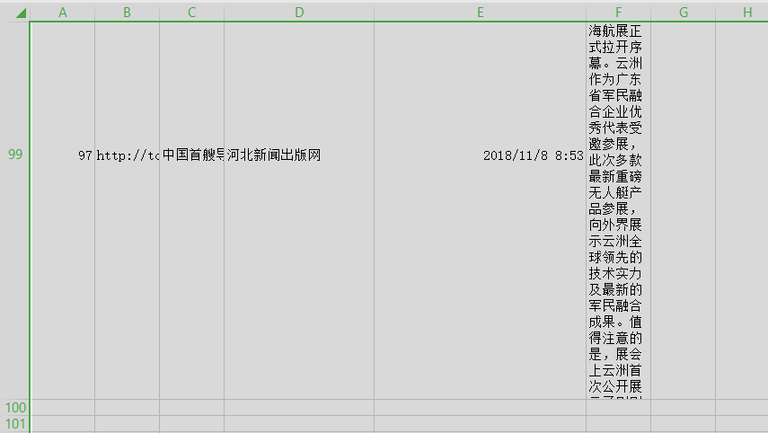

# HeadlineCrawer
今日头条爬虫

## 问题描述 ##  
输入关键字keyword，爬取相关内容的文章信息，并存储（excel）

## 技术背景 ##  
操作系统：win10  
相关py库、软件：python-v3.7、requests、selenium-3.141.0、BeautifulSoup-v4、chromedriver.exe、Google浏览器、pandas

## 解决方案 ##
### 方案一(放弃) ###  
**步骤：**
1. 利用request + BeautifulSoup技术方案，首先对头条[关键字文章列表页](https://www.toutiao.com/search/?keyword=%E5%9B%BE%E7%89%87)进行爬取，
获取每个文章详情页的url
2. 爬取每个文章详情内容，利用BeautifulSoup解析文章内容

**难点：**  
1. 访问爬取到的文章url时，实际在浏览器中会发生重定向(# http://toutiao.com/group/6519751747085271566/ -> http://toutiao.com/a6519751747085271566/)，此过程利用爬虫程序操作时会有难度
2. 即使访问文章重定向后的url，返回的实际为一串js代码，经浏览器处理后才加载真实文章内容。爬虫程序模拟此过程较繁琐。

### 方案二 ###  
**步骤：**  
1. 通过request + BeautifulSoup获取到相关文章的url  
2. 利用selenium库直接操作Google浏览器，对文章url进行访问，并对页面的最终加载效果进行解析  
 
**缺点：**  
1. 慢

## 实施实例 ##  

## 常见问题 ##  
1. 在头条关键字搜索页里面爬取出来的文章详情url，其url不全是头条站点的，需对多个类型站点编写页面解析代码。  
2. 网页结构不固定  

## 参考 ##  
[windows环境下安装selenium+python](https://www.cnblogs.com/onetheway2018/p/8568910.html)
[Selenium with Python中文翻译文档](https://selenium-python-zh.readthedocs.io/en/latest/index.html)
[selenium库的基本使用](https://www.jianshu.com/p/3aa45532e179)

[python中如何使用pandas创建excel文件](https://jingyan.baidu.com/article/ca41422f79039c1eaf99ed73.html)
[pandas官方文档](https://pandas.pydata.org/)
